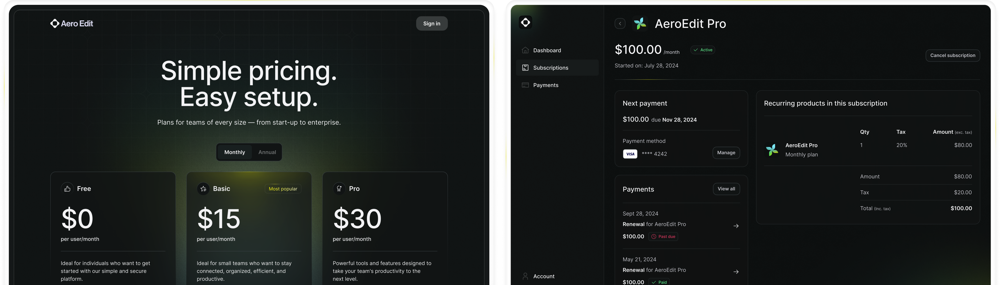

# Paddle Billing subscriptions Next.js starter kit

[Paddle Billing](https://www.paddle.com/billing?utm_source=dx&utm_medium=paddle-nextjs-starter-kit) is a complete digital product sales and subscription management platform, designed for modern software businesses. It helps you increase your revenue, retain customers, and scale your operations.

This is a complete starter kit that you can use to build and deploy a [Next.js](https://nextjs.org/) SaaS app powered by Paddle Billing.

> **Important:** This starter kit works with Paddle Billing. It does not support Paddle Classic. To work with Paddle Classic, see: [Paddle Classic API reference](https://developer.paddle.com/classic/api-reference/1384a288aca7a-api-reference?utm_source=dx&utm_medium=paddle-nextjs-starter-kit)

## Demo

See it in action: [https://paddle-billing.vercel.app/](https://paddle-billing.vercel.app/?utm_source=dx&utm_medium=paddle-nextjs-starter-kit)



## Features

- Three-tier pricing page that's fully localized for 200+ markets using [Paddle.js](https://developer.paddle.com/paddlejs/overview).
- An integrated checkout experience built with [Paddle Checkout](https://developer.paddle.com/concepts/sell/self-serve-checkout), with secure [optimized payments](https://developer.paddle.com/concepts/payment-methods/overview?utm_source=dx&utm_medium=paddle-nextjs-starter-kit) by card, Apple Pay, Google Pay, PayPal, and others.
- User management and auth handled by [Supabase](https://supabase.com/).
- Ready-made screens to let customers manage their payments and subscriptions.
- Automatic syncing of customer and subscription data between Paddle and your app using [webhooks](https://developer.paddle.com/webhooks/overview?utm_source=dx&utm_medium=paddle-nextjs-starter-kit).

## Stack

This starter kit is built with:

- **Framework:** [Next.js](https://nextjs.org/)
- **Auth and user management:** [Supabase](https://supabase.com/)
- **Component library:** [Ant Design](https://ant.design/)
- **CSS framework:** [Tailwind](https://tailwindcss.com/)
- **Billing solution**: [Paddle Billing](https://www.paddle.com/billing?utm_source=dx&utm_medium=paddle-nextjs-starter-kit)

## Prerequisites

### Local dev environment

- [Node.js](https://nodejs.org/en/download/package-manager/current) version > `20`
- [npm](https://www.npmjs.com/), [Yarn](https://yarnpkg.com/), or [pnpm](https://pnpm.io/)

### Accounts

- [Vercel account](https://vercel.com/)
- [Supabase account](https://supabase.com/)
- [Paddle Billing](https://sandbox-login.paddle.com/signup?utm_source=dx&utm_medium=paddle-nextjs-starter-kit) — sandbox recommended

## Step-by-step setup

> **Important:** If you're totally new to Next.js and Paddle, we have a more complete tutorial on our dev docs: [Build and deploy Next.js app with Vercel and Supabase](https://developer.paddle.com/build/nextjs-supabase-vercel-starter-kit?utm_source=dx&utm_medium=paddle-nextjs-starter-kit)

### 1. Deploy on Vercel

#### Start deploy

Click this button to clone this repo and create a new project in your Vercel account:

[](https://vercel.com/new/clone?repository-url=https%3A%2F%2Fgithub.com%2FPaddleHQ%2Fpaddle-nextjs-starter-kit&env=PADDLE_API_KEY,PADDLE_NOTIFICATION_WEBHOOK_SECRET,NEXT_PUBLIC_PADDLE_ENV,NEXT_PUBLIC_PADDLE_CLIENT_TOKEN&integration-ids=oac_VqOgBHqhEoFTPzGkPd7L0iH6&external-id=https%3A%2F%2Fgithub.com%2FPaddleHQ%2Fpaddle-nextjs-starter-kit%2Ftree%2Fmain)

You can also [create a new application manually](https://vercel.com/new).

#### Configure project

Click **Add** to walk through integrating with Supabase. You'll be asked to authenticate with Supabase and confirm creating the database schemas.

Then, enter Paddle environment variables:

| Variable                             | Used for                                                                                                                                                                                                                                                                   | How to get it                                                                                                                                                                                                                                                |
| ------------------------------------ | -------------------------------------------------------------------------------------------------------------------------------------------------------------------------------------------------------------------------------------------------------------------------- | ------------------------------------------------------------------------------------------------------------------------------------------------------------------------------------------------------------------------------------------------------------ |
| `PADDLE_API_KEY`                     | An [API key](https://developer.paddle.com/api-reference/about/authentication?utm_source=dx&utm_medium=paddle-nextjs-starter-kit), used for interacting with Paddle data in the backend. For example, syncing customer and subscription data with Supabase.                 | Go to [**Paddle > Developer tools > Authentication**](https://sandbox-vendors.paddle.com/authentication-v2) and create a new API key.                                                                                                                        |
| `NEXT_PUBLIC_PADDLE_CLIENT_TOKEN`    | A [client-side key](https://developer.paddle.com/api-reference/about/authentication?utm_source=dx&utm_medium=paddle-nextjs-starter-kit), used for interacting with Paddle in the frontend. For example, getting localized prices for pricing pages and opening a checkout. | Go to [**Paddle > Developer tools > Authentication**](https://sandbox-vendors.paddle.com/authentication-v2) and create a new client-side token.                                                                                                              |
| `PADDLE_NOTIFICATION_WEBHOOK_SECRET` | A secret key used for verifying that [webhooks](https://developer.paddle.com/webhooks/notification-destinations?utm_source=dx&utm_medium=paddle-nextjs-starter-kit) came from Paddle and haven't been tampered with in transit. Important for security.                    | Go to [**Paddle > Developer tools > Notifications**](https://sandbox-vendors.paddle.com/notifications), create a new notification destination for your Vercel deploy URL + `/api/webhook`, then edit to copy the secret key. See below for more information. |
| `NEXT_PUBLIC_PADDLE_ENV`             | Environment for our Paddle account. This should match the kind of Paddle account you signed up for.                                                                                                                                                                        | Enter `sandbox` for sandbox accounts or `production` for live accounts.                                                                                                                                                                                      |

Use `https://<PROJECTNAME>.vercel.app/api/webhook` as the endpoint URL for your notification destination, where `<PROJECTNAME>` is the name of your project in Vercel. For example, `https://paddle-billing.vercel.app/api/webhook`.

If your project name isn't unique, your Vercel deploy URL may not match the URL you enter here. We can review and update this after deploy.

#### Deploy

Click **Deploy** when you're done. Wait for Vercel to build.

### 2. Set up product catalog

#### Clone locally

1. Clone the repository you created earlier.

   ```sh
   git clone https://github.com/PATH_TO_YOUR_REPO
   ```

2. Install dependencies using npm, Yarn, or pnpm.

   Install using npm:

   ```sh
   npm install
   ```

   Install using Yarn:

   ```sh
   yarn install
   ```

   Install using pnpm:

   ```sh
   pnpm install
   ```

#### Add products and prices

[Create products and prices](https://developer.paddle.com/build/products/create-products-prices?utm_source=dx&utm_medium=paddle-nextjs-starter-kit) in Paddle for your subscription plans. We recommend creating three products for your plans, with two prices for each product to describe how you bill. For example, create a product called "Pro plan" with two prices for "monthly" and "annual."

Next, copy your price IDs and update the [`pricing-tier.ts`](src/constants/pricing-tier.ts) constants file with your new prices.

Commit and push your changes to `main`.

### 3. Add URL to Paddle and test

#### Add deploy URL to Paddle

You must add URLs to Paddle before you can launch a checkout from them. This protects you as a seller, making sure that only you're able to sell your products.

1. Go to [**Paddle > Checkout > Website approval**](https://sandbox-vendors.paddle.com/request-domain-approval), then enter your Vercel demo app link and click **Submit for approval**.
2. Go to [**Paddle > Checkout > Checkout settings**](https://sandbox-vendors.paddle.com/checkout-settings), then enter your Vercel demo app link as your default payment link and click **Save**.
3. Go to [**Paddle > Developer tools > Notifications**](https://sandbox-vendors.paddle.com/notifications), then check that the endpoint URL matches your Vercel demo app link domain.

> **Important:** Website approval is instant for sandbox accounts, but may take a little while for live accounts while the Paddle seller verification team check your website.

#### Test

Open your Vercel demo site. You should notice that Paddle returns the prices you entered for each of your plans on your pricing page.

Click **Get started** to launch a checkout for a plan, then take a test payment.

If you're using a sandbox account, you can take a test payment using [our test card details](https://developer.paddle.com/concepts/payment-methods/credit-debit-card?utm_source=dx&utm_medium=paddle-nextjs-starter-kit):

| Field                      | Value                                 |
| -------------------------- | ------------------------------------- |
| **Email address**          | An email address you own              |
| **Country**                | Any valid country supported by Paddle |
| **ZIP code** (if required) | Any valid ZIP or postal code          |
| **Card number**            | `4242 4242 4242 4242`                 |
| **Name on card**           | Any name                              |
| **Expiration date**        | Any valid date in the future.         |
| **Security code**          | `100`                                 |

After checkout is completed, head back to the homepage and click **Sign in**. Have a look at the subscriptions and payments pages. They pull information from Paddle about a customer's subscriptions and transactions.

### 4. Next steps

You're done! 🎉 You can use this starter kit as a basis for building a SaaS app powered by Paddle Billing.

Once you've built your app, transition to a live account to start taking real payments:

1. [Sign up for a live account](https://login.paddle.com/signup?utm_source=dx&utm_medium=paddle-nextjs-starter-kit), then follow our [go-live checklist](https://developer.paddle.com/build/onboarding/go-live-checklist) to transition from sandbox to live.
2. Update your environment variables so they're for your live account.
3. Create new schemas in Supabase for your live data.
4. [Set up Paddle Retain](https://developer.paddle.com/build/retain/set-up-retain-profitwell) to handle payment recovery.

## Get help

For help, contact the Paddle DX team at `team-dx@paddle.com`.

## Learn more

- [Build and deploy Next.js app with Vercel and Supabase](https://developer.paddle.com/build/nextjs-supabase-vercel-starter-kit?utm_source=dx&utm_medium=paddle-nextjs-starter-kit)
- [Paddle API reference](https://developer.paddle.com/api-reference/overview?utm_source=dx&utm_medium=paddle-nextjs-starter-kit)
- [Sign up for Paddle Billing](https://sandbox-login.paddle.com/signup?utm_source=dx&utm_medium=paddle-nextjs-starter-kit)
